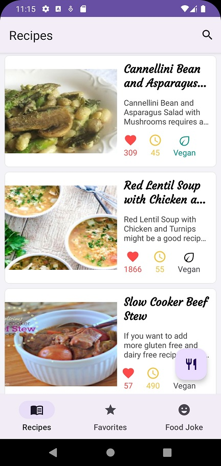
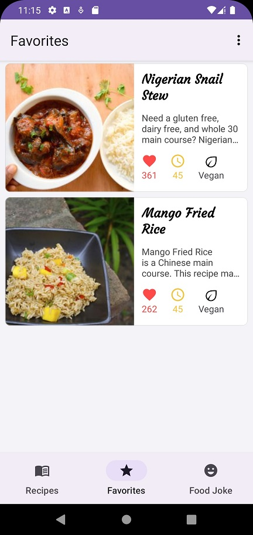
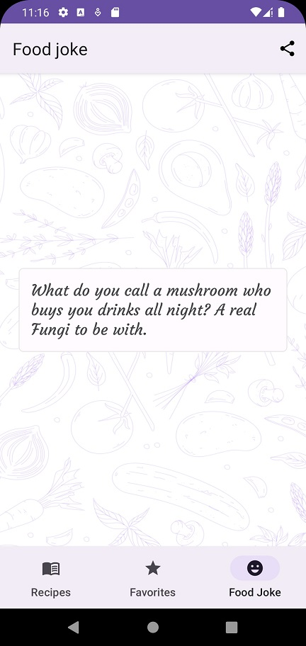
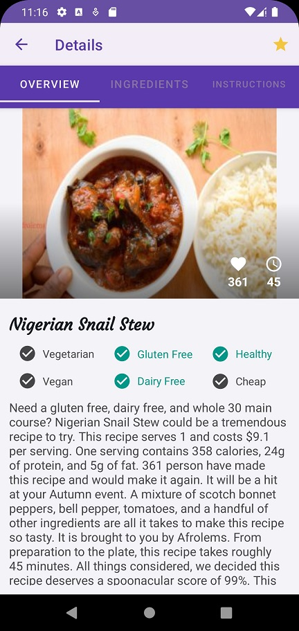
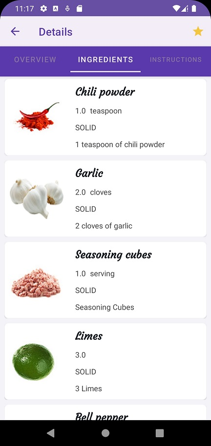
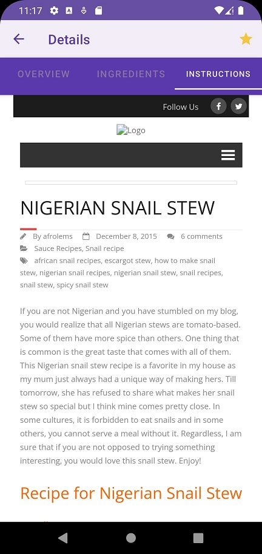

# AS-Kotlin-MVVM-FoodRecipes
Application that retrieves, browses and saves food recipes using the Spoonacular.com API service.

## Architecture Used
MVVM Architecture

## Libraries
- Jetpack Navigation + SafeArgs
- Room
- DataStore Preferences
- Dagger-Hilt
- DataBinding
- Retrofit
- Glide
- Jsoup HTML parser
- Shimmer

## Output
 ### Recipes Tab

 ### Favorites Tab

 ### Food Joke Tab

 ### Overview Details

### Ingredients Details

### Instructions Details

